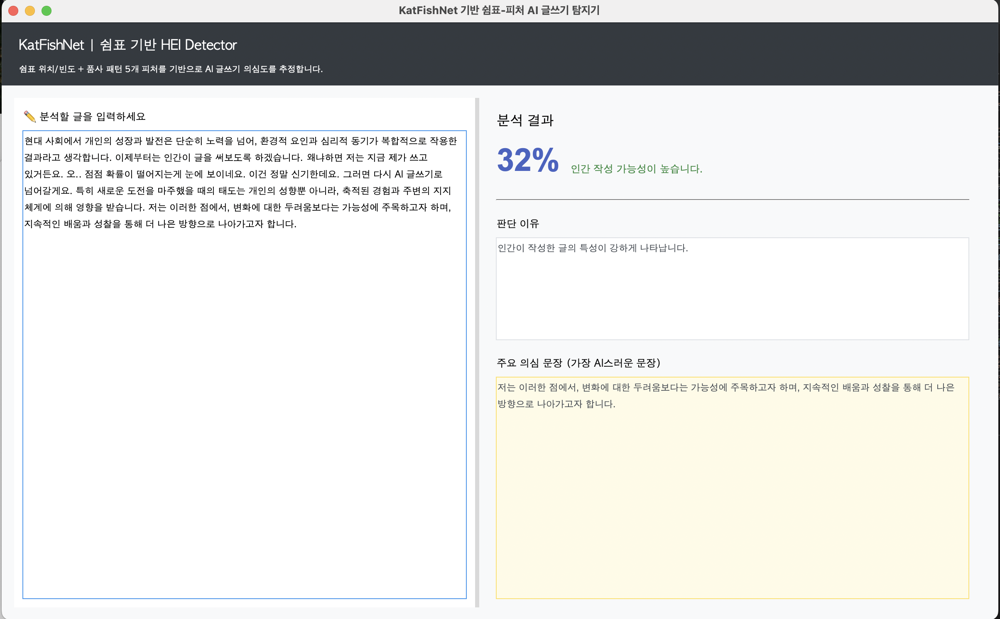

# 인간 지표 기반 실시간 AI 글쓰기 탐지기

<p align="center">
  
</p>

## 프로젝트 개요

최근 AI 글쓰기 모델(GPT 기반 LLM)의 사용이 급격히 증가하면서,  
**인간이 쓴 글을 AI로 잘못 탐지하는 ‘오탐(False Positive)’ 문제**는  
대학 과제·자소서·보고서 등의 실사용 환경에서 실제 제기되고 있습니다.

본 프로젝트는 **KatFishNet**의 기존 AI 탐지 방식이  
특정 문장 구조·쉼표 패턴·작성 스타일에 의해  
**사람이 쓴 글도 AI로 잘못 분류되는 문제**에 주목하여 시작되었습니다.

---

## 핵심 목표

### ✔ 1. KatFishNet의 오탐 원인 분석  
- 수천 개의 사람 글을 넣어 KatFishNet이 강하게 오탐하는 패턴 분석  
- 특히 **쉼표 사용**, **문장 길이 변화 감소**, **품사 패턴 일관성**이 오탐의 핵심 요인임을 발견  
- 이를 정량화하여 **HEI(Human Expression Indicator)** 지표로 재정의

### ✔ 2. HEI 기반 자체 피처(feature) 설계  
쉼표·문장 구조 중심으로 다음 5가지 정량 지표를 구축:

| Feature | 설명 |
|--------|------|
| comma_include_sentence_rate | 쉼표가 포함된 문장의 비율 |
| avg_comma_rate | 문장당 쉼표 평균 사용량 |
| relative_comma_position | 쉼표 위치가 문장 중 어디에 몰려있는지 |
| avg_segment_length | 쉼표로 분리된 구간 길이의 일관성 |
| pos_pattern_diversity | 쉼표 앞뒤 품사 패턴의 다양성 |

이 5개 지표는 KatFishNet의 오탐 패턴을 **정확하게 역추적하기 위해 설계**됨.

---

## ⚙ 시스템 구성

### ✔ 실시간 AI 탐지기 (Tkinter GUI)

- 글자 입력 시 **0.8초 단위**로 자동 분석  
- 문장별 AI 확률 분석 + 전체 문서 확률 결합  
- **인간스러운 문장이 많으면 자동으로 확률이 내려가는 감도 조정 알고리즘** 적용  
- KatFishNet 모델(joblib)을 그대로 사용 가능  
- 아래와 같은 형식으로 실시간 결과 제공:


---

## 탐지 알고리즘 요약

### ✔ 1. 전체 문서(doc) 확률  
KatFishNet 모델이 5개 HEI 피처로 평가한 전체 텍스트 AI 확률

### ✔ 2. 문장별(sentence) 확률  
문장 단위로 토막 내어 각각 평가 → 가장 AI스러운 문장 추출

### ✔ 3. 문장 분포 기반 보정  
- 사람 같은 문장 비율이 높으면 → 확률 자동 감소  
- AI 같은 문장 비율이 높으면 → 확률 자동 증가  
- 최근 5회값을 기반으로 **시간 스무딩(smoothing)**

→ 결과적으로 “첫 문장이 AI처럼 보여도, 이후 사람이 쓴 문장이 많으면 확률이 안정적으로 내려감”

---

## 적용 예시

- AI 스타일 문장만 입력 → 확률 0.9~1.0  
- 사람 스타일의 짧고 불규칙한 문장 섞을 경우 → 확률 점진적 감소  
- 문장 흐름·품사 패턴·쉼표 사용 모두 인간처럼 작성 → 0.1~0.2 이하 유지

---

## 폴더 구성
~~~bash
ai-detector/

├── gui_app.py              # Tkinter 기반 실시간 탐지 UI
├── feature_extractor_local.py
├── model.joblib            # KatFishNet 제공 Logistic Regression 모델
├── scaler.joblib           # KatFishNet 스케일러
├── tfidf_vectorizer.joblib # 필요 시 사용
├── screenshots/
└── README.md
~~~
---

## 실행 방법

```bash
pip install -r requirements.txt
python gui_app.py

📌 프로젝트 의의

이 시스템은 단순히 KatFishNet 모델을 호출하는 것을 넘어,
사람이 쓴 글이 AI로 잘못 탐지되지 않도록 보정하는 알고리즘을 구현했다는 점에서 의미가 큼.
	•	대학 과제 자동 검증 시스템 보완
	•	채용 AI 필터링 보조
	•	글쓰기 플랫폼에서의 AI/인간 혼합 작성 검출
	•	AI 윤리 프로젝트에 활용 가능
